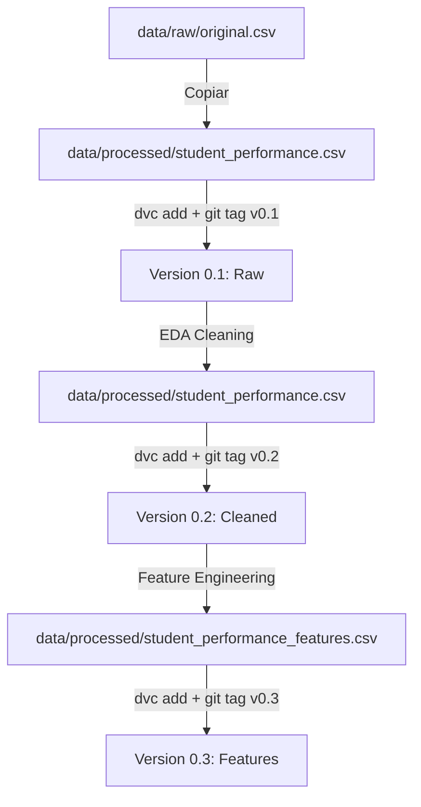

# 📦 Flujo de Versionado de Datos con DVC

## 🎯 Objetivo
Versionar correctamente el dataset usando DVC para mantener un historial de cambios sin duplicar archivos con nombres diferentes.

## 📁 Estructura Propuesta

```
data/
├── raw/
│   └── student_entry_performance_original.csv    # Datos originales (sin tocar)
└── processed/
    └── student_performance.csv                    # Archivo versionado con DVC
```

## 🔄 Flujo de Trabajo con DVC

### **Concepto Clave**
En lugar de tener múltiples archivos (`modified.csv`, `modified_after_eda.csv`, etc.), tenemos **UN SOLO ARCHIVO** cuyas versiones se gestionan con DVC mediante commits de Git.

### **Paso 1: Configuración Inicial** ✅ (Ya completado)

Tu DVC ya está inicializado en `.dvc/`. Ahora necesitas configurar un remote storage.

#### Opción A: Remote Local (Recomendado para desarrollo)
```bash
# Crear directorio para almacenamiento DVC (fuera del proyecto)
mkdir -p ~/dvc-storage/equipo36mlops

# Configurar remote local
dvc remote add -d local ~/dvc-storage/equipo36mlops

# Verificar configuración
dvc remote list
```

#### Opción B: Remote en Google Drive (Recomendado para equipo)
```bash
# Configurar Google Drive como remote
dvc remote add -d gdrive gdrive://1YourFolderIDHere

# Autenticar
dvc remote modify gdrive gdrive_acknowledge_abuse true
```

#### Opción C: Remote en S3/Azure/GCS (Producción)
```bash
# Ejemplo con S3
dvc remote add -d s3remote s3://mybucket/dvcstore
```

---

### **Paso 2: Preparar el Dataset Inicial**

```bash
# Copiar el dataset original como base
cp data/raw/student_entry_performance_original.csv data/processed/student_performance.csv

# Agregar el archivo a DVC (esto crea student_performance.csv.dvc)
dvc add data/processed/student_performance.csv

# Commitear el archivo .dvc a Git
git add data/processed/student_performance.csv.dvc data/processed/.gitignore
git commit -m "feat: add initial raw dataset version to DVC"
git tag -a "data-v0.1-raw" -m "Version 0.1: Raw data"

# Subir los datos al remote de DVC
dvc push
```

**✨ Resultado:** Versión 0.1 del dataset (datos raw) está guardada y versionada.

---

### **Paso 3: Aplicar EDA y Guardar Nueva Versión**

Ahora ejecutas tu notebook de EDA que:
1. Lee `data/processed/student_performance.csv`
2. Aplica limpieza y transformaciones
3. **SOBRESCRIBE** el mismo archivo: `data/processed/student_performance.csv`

```bash
# Después de ejecutar el notebook de EDA, actualizar DVC
dvc add data/processed/student_performance.csv

# Commitear la nueva versión
git add data/processed/student_performance.csv.dvc
git commit -m "feat: apply EDA cleaning - remove nulls, normalize text"
git tag -a "data-v0.2-cleaned" -m "Version 0.2: Data after EDA cleaning"

# Subir la nueva versión
dvc push
```

**✨ Resultado:** Versión 0.2 (después de EDA) está guardada. Puedes volver a v0.1 cuando quieras.

---

### **Paso 4: Aplicar Preprocessing y Guardar Nueva Versión**

Tu segundo notebook:
1. Lee `data/processed/student_performance.csv` (versión limpia)
2. Aplica encoding, PCA, etc.
3. Guarda el resultado en un archivo diferente: `data/processed/student_performance_features.csv`

```bash
# Agregar el nuevo archivo de features a DVC
dvc add data/processed/student_performance_features.csv

# Commitear
git add data/processed/student_performance_features.csv.dvc
git commit -m "feat: add engineered features with PCA"
git tag -a "data-v0.3-features" -m "Version 0.3: Features ready for modeling"

# Subir
dvc push
```

---

### **Paso 5: Recuperar Versiones Anteriores**

#### Ver historial de versiones
```bash
git log --oneline --tags
```

#### Volver a una versión específica
```bash
# Volver a la versión raw (v0.1)
git checkout data-v0.1-raw

# Descargar esa versión del dataset
dvc pull

# El archivo data/processed/student_performance.csv ahora contiene la versión raw
```

#### Volver a la última versión
```bash
git checkout main  # o tu rama principal
dvc pull
```

---

## 🔨 Comandos DVC Esenciales

| Comando | Descripción |
|---------|-------------|
| `dvc add <archivo>` | Versionar un archivo con DVC |
| `dvc push` | Subir cambios al remote storage |
| `dvc pull` | Descargar datos del remote storage |
| `dvc checkout` | Sincronizar archivos con versión en Git |
| `dvc status` | Ver estado de archivos versionados |
| `dvc diff` | Ver diferencias entre versiones |

---

## 📊 Flujo Completo del Proyecto



---

## ✅ Ventajas de este Flujo

1. **Un solo nombre de archivo** → No más `_modified`, `_after_eda`, `_v2`, etc.
2. **Historial completo** → Puedes volver a cualquier versión
3. **Git + DVC integrados** → Cada versión de código tiene su versión de datos
4. **Colaboración fácil** → Equipo sincronizado con `dvc pull`
5. **Sin archivos grandes en Git** → Solo metadatos en `.dvc` files

---

## 🚨 Errores Comunes a Evitar

❌ **NO hacer:** `git add data/processed/student_performance.csv`
✅ **SÍ hacer:** `dvc add data/processed/student_performance.csv`

❌ **NO hacer:** Crear archivos con nombres diferentes para cada versión
✅ **SÍ hacer:** Sobrescribir el mismo archivo y hacer `dvc add` + `git commit`

❌ **NO olvidar:** Hacer `dvc push` después de `dvc add`
✅ **Recordar:** `dvc add` → `git commit` → `dvc push` → `git push`

---

## 📝 Plantilla de Commits

```bash
# Patrón recomendado
git commit -m "feat: <descripción del cambio en los datos>"
git tag -a "data-v<version>-<etapa>" -m "<descripción detallada>"

# Ejemplos
git commit -m "feat: remove outliers and impute missing values"
git tag -a "data-v1.0-cleaned" -m "Version 1.0: Data cleaning completed"

git commit -m "feat: add PCA features and normalize scales"
git tag -a "data-v1.1-features" -m "Version 1.1: Feature engineering applied"
```

---

## 🎓 Siguiente Paso

Ahora que entiendes el flujo, ejecuta los comandos del **Paso 1 y 2** para consolidar tu dataset actual en una versión inicial versionada con DVC.

