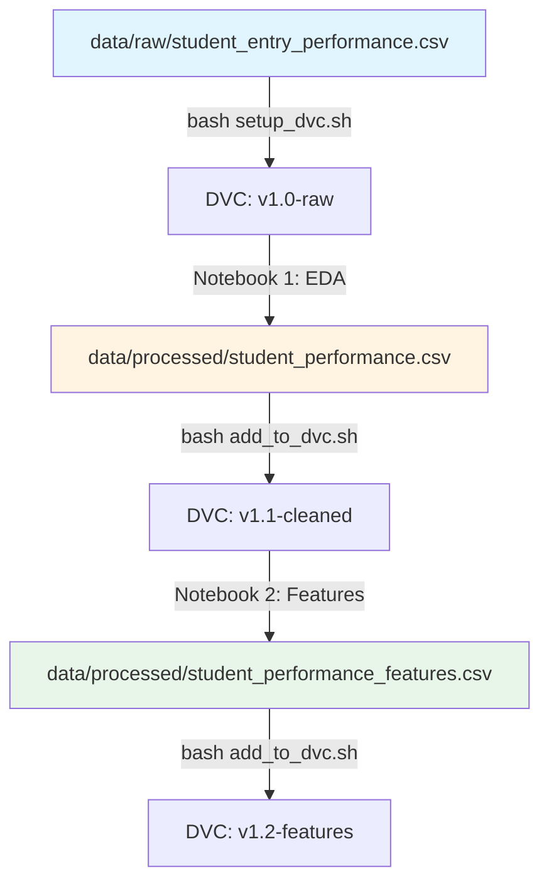

# 📦 Flujo de Versionado de Datos con DVC

## 🎯 Objetivo
Versionar correctamente los datasets usando DVC para mantener un historial de cambios sin duplicar archivos con nombres diferentes.

## 📁 Estructura del Proyecto

```
data/
├── raw/
│   └── student_entry_performance.csv          # Dataset original [DVC: v1.0-raw]
└── processed/
    ├── student_performance.csv                 # Dataset limpio [DVC: v1.1-cleaned]
    └── student_performance_features.csv        # Features para ML [DVC: v1.2-features]
```

## 🔄 Flujo de Trabajo con DVC

### **Concepto Clave**
En lugar de tener múltiples archivos con nombres diferentes (`modified.csv`, `modified_after_eda.csv`, etc.), versionamos archivos donde están y usamos Git tags para identificar cada versión del pipeline de datos.

### **Paso 1: Configuración Inicial del Remote**

Tu DVC ya está inicializado en `.dvc/`. Ahora necesitas configurar un remote storage.

#### Opción A: Remote Local (Recomendado para desarrollo)
```bash
# Crear directorio para almacenamiento DVC (fuera del proyecto)
mkdir -p ~/dvc-storage/equipo36mlops

# Configurar remote local
dvc remote add -d local ~/dvc-storage/equipo36mlops

# Commitear la configuración
git add .dvc/config
git commit -m "chore: configure DVC local remote"

# Verificar configuración
dvc remote list
```

#### Opción B: Remote en Google Drive (Recomendado para equipo)
```bash
# 1. Crear carpeta en Google Drive
# 2. Copiar el ID de la URL: drive.google.com/drive/folders/ESTE_ES_EL_ID

# Configurar Google Drive como remote
dvc remote add -d gdrive gdrive://TU_FOLDER_ID_AQUI

# Configurar opciones
dvc remote modify gdrive gdrive_acknowledge_abuse true

# Commitear
git add .dvc/config
git commit -m "chore: configure DVC Google Drive remote"
```

#### Opción C: Remote en S3/Azure/GCS (Producción)
```bash
# Ejemplo con S3
dvc remote add -d s3remote s3://mybucket/dvcstore

# Commitear
git add .dvc/config
git commit -m "chore: configure DVC remote"
```

---

### **Paso 2: Versionar el Dataset Original**

Usamos el script `setup_dvc.sh` para versionar el archivo fuente.

#### Opción A: Modo Interactivo (Recomendado)
```bash
bash setup_dvc.sh
# El script te mostrará todos los CSV y podrás seleccionar
# Selecciona: data/raw/student_entry_performance.csv
# Remote: opción 3 (skip - ya lo configuraste)
# Tag: data-v1.0-raw
# Descripción: Raw dataset from source
```

#### Opción B: Modo Directo
```bash
# Especificar directamente el archivo
bash setup_dvc.sh data/raw/student_entry_performance.csv

# Durante el script:
# - Remote: opción 3 (skip - ya configurado)
# - Tag: data-v1.0-raw
# - Descripción: Raw dataset from source
```

#### O Manualmente:
```bash
# Agregar el archivo a DVC
dvc add data/raw/student_entry_performance.csv

# Commitear el archivo .dvc a Git
git add data/raw/student_entry_performance.csv.dvc data/raw/.gitignore
git commit -m "feat: add raw dataset to DVC tracking"
git tag -a "data-v1.0-raw" -m "Version 1.0: Raw dataset from source"

# Subir los datos al remote de DVC
dvc push
git push --tags
```

**✨ Resultado:** Archivo original versionado como `data-v1.0-raw`

---

### **Paso 3: Ejecutar Notebook de EDA y Versionar Resultado**

Ejecuta el notebook `1.0-el-EDA_cleaning.ipynb` que:
1. Lee `data/raw/student_entry_performance.csv` (versión raw)
2. Aplica limpieza: mayúsculas, trim, manejo de nulls, eliminación de columnas
3. Guarda resultado en `data/processed/student_performance.csv`

```bash
# 1. Ejecutar el notebook
jupyter notebook notebooks/1.0-el-EDA_cleaning.ipynb

# 2. Después de ejecutar, versionar el resultado
```

#### Opción A: Usar el script rápido (Recomendado)
```bash
bash add_to_dvc.sh data/processed/student_performance.csv data-v1.1-cleaned "After EDA cleaning"
dvc push
git push --tags
```

#### Opción B: Comandos manuales
```bash
dvc add data/processed/student_performance.csv
git add data/processed/student_performance.csv.dvc data/processed/.gitignore
git commit -m "feat: apply EDA cleaning - normalize text, handle nulls"
git tag -a "data-v1.1-cleaned" -m "Version 1.1: Data after EDA cleaning"
dvc push
git push --tags
```

**✨ Resultado:** Dataset limpio versionado como `data-v1.1-cleaned`

---

### **Paso 4: Ejecutar Notebook de Preprocessing y Versionar Features**

Ejecuta el notebook `Preprocesamieto de Datos.ipynb` que:
1. Lee `data/processed/student_performance.csv` (versión limpia)
2. Aplica Chi-cuadrada, Spearman, One-Hot Encoding, PCA
3. Guarda features en `data/processed/student_performance_features.csv`

```bash
# 1. Ejecutar el notebook
jupyter notebook notebooks/Preprocesamieto\ de\ Datos.ipynb

# 2. Después de ejecutar, versionar las features
```

#### Opción A: Usar el script rápido (Recomendado)
```bash
bash add_to_dvc.sh data/processed/student_performance_features.csv data-v1.2-features "Features with PCA ready for modeling"
dvc push
git push --tags
```

#### Opción B: Comandos manuales
```bash
dvc add data/processed/student_performance_features.csv
git add data/processed/student_performance_features.dvc
git commit -m "feat: add engineered features with PCA and encoding"
git tag -a "data-v1.2-features" -m "Version 1.2: Features ready for modeling"
dvc push
git push --tags
```

**✨ Resultado:** Features listas para modelado versionadas como `data-v1.2-features`

---

### **Paso 5: Recuperar Versiones Anteriores**

#### Ver historial de versiones
```bash
# Ver todos los tags
git tag -l "data-*"

# Ver historial completo
git log --oneline --tags
```

#### Volver a una versión específica
```bash
# Ejemplo: Volver a la versión raw original
git checkout data-v1.0-raw

# Sincronizar archivos con esa versión
dvc checkout

# Ver el archivo (ahora contiene la versión raw)
head data/raw/student_entry_performance.csv
```

#### Volver a la última versión
```bash
git checkout main  # o feature/dvc
dvc checkout

# O simplemente hacer pull
git pull
dvc pull
```

---

## 🔨 Comandos DVC Esenciales

| Comando | Descripción |
|---------|-------------|
| `dvc add <archivo>` | Versionar un archivo con DVC |
| `dvc push` | Subir cambios al remote storage |
| `dvc pull` | Descargar datos del remote storage |
| `dvc checkout` | Sincronizar archivos con versión en Git |
| `dvc status` | Ver estado de archivos versionados |
| `dvc diff` | Ver diferencias entre versiones |

---

## 📊 Flujo Completo del Proyecto



### Pipeline de Datos

| Etapa | Archivo | Versión DVC | Script/Notebook |
|-------|---------|-------------|-----------------|
| **Raw** | `data/raw/student_entry_performance.csv` | v1.0-raw | `setup_dvc.sh` |
| **Cleaned** | `data/processed/student_performance.csv` | v1.1-cleaned | `1.0-el-EDA_cleaning.ipynb` + `add_to_dvc.sh` |
| **Features** | `data/processed/student_performance_features.csv` | v1.2-features | `Preprocesamieto de Datos.ipynb` + `add_to_dvc.sh` |

---

## ✅ Ventajas de este Flujo

1. **Archivos donde pertenecen** → Raw en `raw/`, processed en `processed/`
2. **Sin duplicados** → No más `_modified`, `_after_eda`, `_v2`, etc.
3. **Historial completo** → Puedes volver a cualquier versión con Git tags
4. **Git + DVC integrados** → Cada versión de código tiene su versión de datos
5. **Colaboración fácil** → Equipo sincronizado con `dvc pull`
6. **Sin archivos grandes en Git** → Solo metadatos en `.dvc` files
7. **Scripts automatizados** → `setup_dvc.sh` y `add_to_dvc.sh` simplifican el proceso

---

## 🚨 Errores Comunes a Evitar

❌ **NO hacer:** `git add data/raw/student_entry_performance.csv`
✅ **SÍ hacer:** `dvc add data/raw/student_entry_performance.csv` o usar `bash setup_dvc.sh`

❌ **NO hacer:** Crear archivos con nombres diferentes para cada versión (`_v1`, `_v2`, `_final`)
✅ **SÍ hacer:** Usar archivos significativos y versionar con tags

❌ **NO hacer:** Copiar archivos manualmente entre directorios
✅ **SÍ hacer:** Dejar raw en `raw/`, procesados en `processed/`

❌ **NO olvidar:** Hacer `dvc push` después de `dvc add`
✅ **Recordar:** `dvc add` → `git commit` → `git tag` → `dvc push` → `git push --tags`

❌ **NO hacer:** Ejecutar notebooks desde cualquier directorio
✅ **SÍ hacer:** Ejecutar desde la raíz del proyecto para que las rutas relativas funcionen

---

## 📝 Plantilla de Commits y Tags

```bash
# Patrón recomendado
git commit -m "feat: <descripción del cambio en los datos>"
git tag -a "data-v<version>-<etapa>" -m "<descripción detallada>"

# Ejemplos del proyecto
git commit -m "feat: add raw dataset to DVC tracking"
git tag -a "data-v1.0-raw" -m "Version 1.0: Raw dataset from source"

git commit -m "feat: apply EDA cleaning - normalize text, handle nulls"
git tag -a "data-v1.1-cleaned" -m "Version 1.1: Data after EDA cleaning"

git commit -m "feat: add engineered features with PCA and encoding"
git tag -a "data-v1.2-features" -m "Version 1.2: Features ready for modeling"
```

---

## 🛠️ Scripts Disponibles

### `setup_dvc.sh` - Primera configuración

```bash
# Modo interactivo (te muestra opciones)
bash setup_dvc.sh

# Modo directo (especificas archivo)
bash setup_dvc.sh data/raw/student_entry_performance.csv
```

**Cuándo usar:** Primera vez versionando un archivo

### `add_to_dvc.sh` - Agregar archivos rápidamente

```bash
# Básico
bash add_to_dvc.sh data/processed/archivo.csv

# Con tag y descripción
bash add_to_dvc.sh data/processed/archivo.csv data-v1.1 "Descripción"
```

**Cuándo usar:** DVC ya configurado, solo quieres versionar un archivo

---

## 🎓 Siguiente Paso

Ahora que entiendes el flujo:

1. Configura el remote (Paso 1)
2. Ejecuta `bash setup_dvc.sh data/raw/student_entry_performance.csv` (Paso 2)
3. Ejecuta los notebooks en orden (Pasos 3 y 4)
4. Versiona cada resultado con `add_to_dvc.sh`

