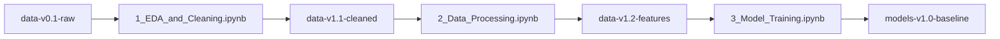

# 📦 Guía Completa de Versionado de Datos con DVC
## Equipo 36 - MLOps

---

## 🎯 Objetivo

Este documento describe el flujo completo de versionado de datos y modelos en el proyecto `equipo36mlops` utilizando **DVC (Data Version Control)** con almacenamiento remoto en **AWS S3**.

---

## 📚 Tabla de Contenidos

1. [Conceptos Básicos](#conceptos-básicos)
2. [Configuración Inicial](#configuración-inicial)
3. [Flujo de Trabajo del Pipeline](#flujo-de-trabajo-del-pipeline)
4. [Comandos Esenciales](#comandos-esenciales)
5. [Mejores Prácticas](#mejores-prácticas)
6. [Resolución de Problemas](#resolución-de-problemas)

---

## 🧠 Conceptos Básicos

### ¿Qué es DVC?

**DVC (Data Version Control)** es una herramienta de código abierto para versionado de datos y modelos de Machine Learning. Funciona de manera similar a Git, pero está diseñada específicamente para archivos grandes y binarios.

### ¿Por qué usar DVC?

✅ **Reproducibilidad**: Puedes recuperar cualquier versión de tus datos o modelos  
✅ **Colaboración**: Tu equipo puede trabajar con los mismos datos versionados  
✅ **Almacenamiento eficiente**: Los archivos grandes se almacenan en S3, no en Git  
✅ **Trazabilidad**: Cada cambio en los datos queda registrado  

### Arquitectura del Proyecto

```
equipo36mlops/
├── data/
│   ├── raw/                          # Datos originales sin procesar
│   │   ├── student_entry_performance.csv
│   │   └── student_entry_performance.csv.dvc  ← Archivo DVC (va a Git)
│   ├── processed/                    # Datos procesados
│   │   ├── student_performance.csv
│   │   ├── student_performance.csv.dvc
│   │   ├── student_performance_features.csv
│   │   └── student_performance_features.csv.dvc
│   └── mlflow/                       # Experimentos y modelos
│       └── mlflow.dvc
├── notebooks/                        # Notebooks del pipeline
│   ├── 1_EDA_and_Cleaning.ipynb
│   ├── 2_Data_Processing.ipynb
│   └── 3_Model_Training_and_Registering.ipynb
├── add_to_dvc.sh                     # Script helper para versionado
└── .dvc/
    └── config                        # Configuración DVC (S3)
```

### Archivos `.dvc`

Los archivos `.dvc` son **metadatos** que DVC crea para trackear tus archivos grandes:

```yaml
outs:
- md5: 3c4fda9b9e4e9f1c8d5e6a7b8c9d0e1f
  size: 98765
  path: student_performance.csv
```

- **md5**: Hash único del archivo para detectar cambios
- **size**: Tamaño del archivo en bytes
- **path**: Ruta relativa del archivo

🔑 **Importante**: Los archivos `.dvc` son pequeños y se guardan en Git, mientras que los archivos grandes se suben a S3.

---

## ⚙️ Configuración Inicial

### 1. Verificar configuración de DVC

```bash
# Ver configuración actual
cat .dvc/config

# Deberías ver algo como:
# [core]
#     remote = s3remote
# ['remote "s3remote"']
#     url = s3://mlops-team36-bucket/equipo36mlops
#     region = us-east-2
```

### 2. Verificar credenciales AWS

```bash
# Verificar que las credenciales estén configuradas
aws sts get-caller-identity

# Si no están configuradas, ejecuta:
bash setup_aws_credentials.sh
```

### 3. Hacer el script ejecutable

```bash
# Dar permisos de ejecución al script helper
chmod +x add_to_dvc.sh
```

---

## 🔄 Flujo de Trabajo del Pipeline

El proyecto tiene **3 notebooks** que se ejecutan secuencialmente, cada uno con su propia versión de datos:

### 📊 Pipeline Completo



### 🔹 Paso 1: EDA y Limpieza de Datos

**Notebook**: `1_EDA_and_Cleaning.ipynb`

**Input**: `data/raw/student_entry_performance.csv` (ya versionado: `data-v1.0-raw`)

**Output**: `data/processed/student_performance.csv`

**Cambios aplicados**:
- Normalización de texto (mayúsculas, trim)
- Manejo de valores nulos
- Eliminación de columna `mixed_type_col`
- Imputación de valores faltantes

**Versionar el resultado**:

```bash
# Ejecutar al terminar el notebook 1
cd /Users/hectoralvarez/Documents/GitHub/equipo36mlops
bash add_to_dvc.sh data/processed/student_performance.csv data-v1.1-cleaned 'Dataset after EDA cleaning'
```

---

### 🔹 Paso 2: Feature Engineering

**Notebook**: `2_Data_Processing.ipynb`

**Input**: `data/processed/student_performance.csv` (versión: `data-v1.1-cleaned`)

**Output**: `data/processed/student_performance_features.csv`

**Cambios aplicados**:
- Análisis de frecuencia de variables
- Chi-cuadrada y Cramer's V para variables nominales
- Correlación de Spearman para variables ordinales
- One-Hot Encoding de variables nominales
- PCA para reducción de dimensionalidad (95% de varianza)

**Versionar el resultado**:

```bash
# Ejecutar al terminar el notebook 2
bash add_to_dvc.sh data/processed/student_performance_features.csv data-v1.2-features 'Features with PCA ready for modeling'
```

---

### 🔹 Paso 3: Entrenamiento de Modelos

**Notebook**: `3_Model_Training_and_Registering.ipynb`

**Input**: `data/processed/student_performance_features.csv` (versión: `data-v1.2-features`)

**Output**: `data/mlflow/` (directorio con experimentos MLflow)

**Modelos entrenados**:
- LightGBM
- XGBoost
- CatBoost

**Métricas registradas**:
- RMSE (Root Mean Squared Error)
- QWK (Quadratic Weighted Kappa)

**Versionar los modelos**:

```bash
# Ejecutar al terminar el notebook 3
bash add_to_dvc.sh data/mlflow models-v1.0-baseline 'Baseline models: LightGBM, XGBoost, CatBoost'
```

---

## 🛠️ Comandos Esenciales

### Versionar un archivo nuevo

```bash
# Opción 1: Usar el script helper (recomendado)
bash add_to_dvc.sh <archivo> <tag> <mensaje>

# Ejemplo:
bash add_to_dvc.sh data/processed/student_performance.csv data-v1.1-cleaned 'Dataset after EDA cleaning'
```

```bash
# Opción 2: Comandos manuales
dvc add <archivo>
git add <archivo>.dvc .gitignore
git commit -m "feat: version data - <descripción>"
git tag -a "<tag>" -m "<mensaje>"
dvc push
git push origin <branch> --tags
```

### Actualizar un archivo ya versionado

```bash
# Cuando modificas un archivo que ya está trackeado por DVC
dvc add data/processed/student_performance.csv
git add data/processed/student_performance.csv.dvc
git commit -m "feat: update data - improved cleaning"
git tag -a "data-v1.1.1-cleaned" -m "Updated cleaning logic"
dvc push
git push origin <branch> --tags
```

### Descargar datos versionados

```bash
# Descargar todos los archivos DVC del commit actual
dvc pull

# Descargar un archivo específico
dvc pull data/processed/student_performance.csv.dvc
```

### Recuperar una versión específica

```bash
# Cambiar a una versión específica por tag
git checkout data-v1.1-cleaned
dvc checkout

# Ver el archivo en esa versión
head data/processed/student_performance.csv

# Volver al estado más reciente
git checkout main  # o tu rama principal
dvc checkout
```

### Ver el estado de DVC

```bash
# Ver qué archivos están trackeados por DVC
dvc status

# Ver el historial de cambios en un archivo
git log --oneline -- data/processed/student_performance.csv.dvc

# Ver tags disponibles
git tag -l
```

### Comparar versiones

```bash
# Ver diferencias entre versiones (metadatos)
git diff data-v1.1-cleaned data-v1.2-features -- data/processed/student_performance.csv.dvc

# Comparar tamaños de archivos
dvc diff data-v1.1-cleaned data-v1.2-features
```

---

## 🌟 Mejores Prácticas

### 1. Nomenclatura de Tags

Usa una convención consistente para los tags:

```
<tipo>-v<major>.<minor>.<patch>-<descripción>

Ejemplos:
- data-v1.0-raw           # Datos originales
- data-v1.1-cleaned       # Primera versión procesada
- data-v1.2-features      # Features engineered
- models-v1.0-baseline    # Modelos baseline
- models-v2.0-optimized   # Modelos optimizados
```

### 2. Mensajes de Commit

Sigue el formato Conventional Commits:

```bash
feat: version data - nueva transformación aplicada
fix: correct data - corregir error en imputación
docs: update DVC workflow documentation
```

### 3. Sincronización del Equipo

```bash
# Al inicio de tu sesión de trabajo
git pull
dvc pull

# Al terminar tu trabajo
bash add_to_dvc.sh <archivo> <tag> <mensaje>
# El script hace automáticamente: dvc push y git push
```

### 4. No versionar archivos temporales

Asegúrate de que `.gitignore` incluya:

```gitignore
# Archivos de datos grandes (manejados por DVC)
/data/raw/*.csv
/data/processed/*.csv
/data/mlflow/

# Archivos temporales
*.tmp
*.swp
__pycache__/
.ipynb_checkpoints/
```

### 5. Documentar cambios en los datos

Cada vez que versiones datos, documenta:
- ¿Qué cambió?
- ¿Por qué cambió?
- ¿Qué impacto tiene en el modelo?

```bash
# Bueno ✅
bash add_to_dvc.sh data/processed/student_performance.csv data-v1.1-cleaned 'Removed outliers and imputed missing values in Class_X_Percentage'

# Malo ❌
bash add_to_dvc.sh data/processed/student_performance.csv data-v1.1 'update'
```

---

## 🔧 Resolución de Problemas

### Problema: "No remote storage is configured"

**Solución**:
```bash
# Verificar configuración
cat .dvc/config

# Si no está configurado, ejecutar:
bash setup_dvc.sh data/raw/student_entry_performance.csv
```

---

### Problema: "Unable to find credentials"

**Solución**:
```bash
# Configurar credenciales AWS
bash setup_aws_credentials.sh

# O manualmente:
aws configure
# Introduce: Access Key ID, Secret Access Key, Region (us-east-2)
```

---

### Problema: "File is already tracked by DVC"

**Causa**: Intentas hacer `dvc add` en un archivo ya versionado.

**Solución**:
```bash
# Para actualizar, simplemente vuelve a hacer dvc add
dvc add data/processed/student_performance.csv
git add data/processed/student_performance.csv.dvc
git commit -m "feat: update data - nueva versión"
```

---

### Problema: "Modified dependencies detected"

**Causa**: El archivo cambió pero no has actualizado DVC.

**Solución**:
```bash
# Actualizar DVC
dvc add <archivo_modificado>
git add <archivo_modificado>.dvc
git commit -m "feat: update data"
dvc push
```

---

### Problema: Tag ya existe

**Solución 1 (actualizar tag local)**:
```bash
# Borrar tag local y recrearlo
git tag -d data-v1.1-cleaned
git tag -a data-v1.1-cleaned -m "Nueva descripción"
```

**Solución 2 (usar nuevo tag)**:
```bash
# Crear un nuevo tag con versión patch
bash add_to_dvc.sh data/processed/student_performance.csv data-v1.1.1-cleaned 'Actualización con mejoras'
```

---

### Problema: No puedo hacer push a S3

**Verificar permisos**:
```bash
# Verificar que tienes acceso al bucket
aws s3 ls s3://mlops-team36-bucket/

# Si no tienes permisos, contacta al administrador del proyecto
```

---

## 📋 Checklist de Trabajo

### Antes de empezar a trabajar:

- [ ] `git pull` - Sincronizar código
- [ ] `dvc pull` - Sincronizar datos
- [ ] Verificar que estás en la rama correcta
- [ ] Verificar que tienes las credenciales AWS configuradas

### Al terminar un notebook:

- [ ] Guardar el archivo de datos procesado
- [ ] Ejecutar `bash add_to_dvc.sh <archivo> <tag> <mensaje>`
- [ ] Verificar que el push a S3 fue exitoso
- [ ] Verificar que el push a Git fue exitoso
- [ ] Documentar los cambios en el commit

### Antes de compartir con el equipo:

- [ ] Verificar que todos los tags están creados
- [ ] Verificar que `dvc push` completó sin errores
- [ ] Verificar que `git push --tags` completó sin errores
- [ ] Avisar al equipo sobre la nueva versión disponible

---

## 🎓 Recursos Adicionales

- [Documentación oficial de DVC](https://dvc.org/doc)
- [DVC con S3](https://dvc.org/doc/user-guide/data-management/remote-storage/amazon-s3)
- [Best practices for MLOps](https://cloud.google.com/architecture/mlops-continuous-delivery-and-automation-pipelines-in-machine-learning)

---

## 👥 Contacto y Soporte

Para preguntas sobre este flujo de trabajo, contacta a:

- **Equipo**: Equipo 36 MLOps
- **Proyecto**: equipo36mlops
- **Bucket S3**: `s3://mlops-team36-bucket/equipo36mlops`

---

**Última actualización**: Octubre 2025  
**Versión del documento**: 1.0

